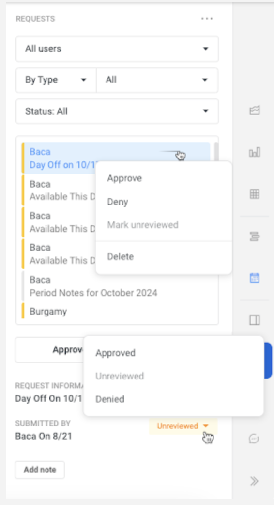

# Approve Unreviewed Requests

Review and update the status of user-submitted requests.

## Approve or Deny a Single Request

1. Select the **User** from either:
    - The list of Users on the left side of the Dashboard, or
    - The list of Users in the Requests window

2. Select the request from the list to view its details at the bottom

3. To approve or deny, either:
    - Right-click the request and select **Approve** or **Deny**, or
    - Change the status dropdown from `Unreviewed` to `Approved` or `Denied`

## Approve All Unreviewed Requests

1. Click the **Approve Unreviewed** button below the list of requests

2. Click **Approve** on the confirmation alert

!!! warning
    Changes in request status are saved immediately without confirmation.

---

## Related Topics

- [Requests Overview](../concepts/requests.md)
- [Request Approval Process](../features/requests/approval-process.md)
- [Edit a Request](edit-request.md)
