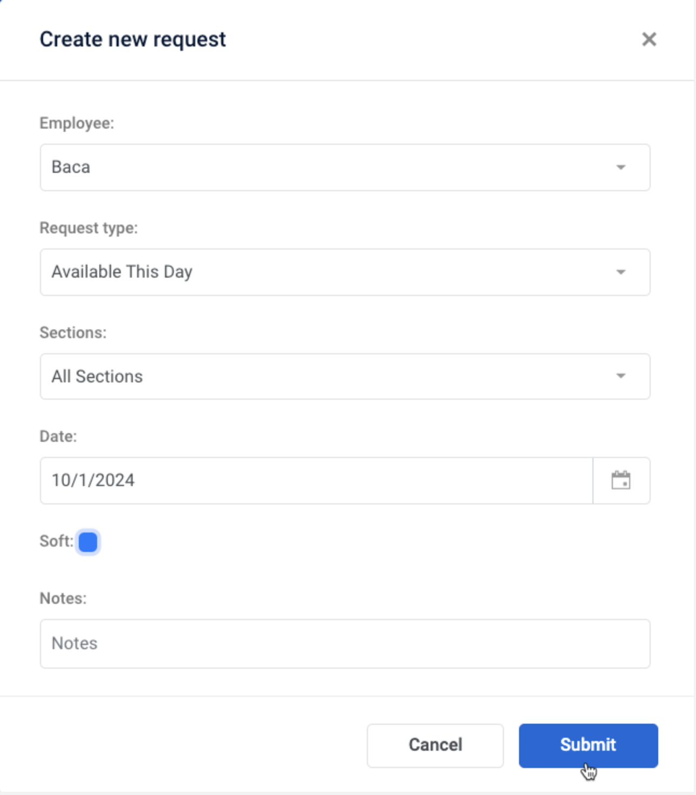

# Submit a Request for a User

As a scheduler, you can create a request on behalf of users who may not have access to Intrigma.

## Steps

1. Select the **User** from either:
    - The list of Users on the left side of the Dashboard, or
    - The list of Users in the Requests window

2. Click **Add Request** at the bottom left of the Requests window

3. In the **Create New Request** dialog:
    - Select the request type
    - Select the section to apply the request to
    - Select the start and end dates

4. *(Optional)* If the request type supports soft requests, check **Soft request**

    !!! info "Soft vs Hard Requests"
        Soft requests are preferences, not guarantees — even if approved.

5. *(Optional)* Add a note

6. Click **Submit**

---

## Related Topics

- [Requests Overview](../concepts/requests.md)
- [Request Approval Process](../features/requests/approval-process.md)
- [User Limits](../features/requests/user-limits.md)
